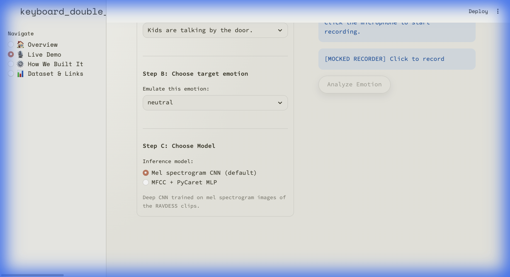

# RAVDESS Speech Emotion Recognition

## Overview
A comprehensive speech emotion classification system built on the [RAVDESS dataset](https://zenodo.org/record/1188976) (Ryerson Audio-Visual Database of Emotional Speech and Song). The project explores multiple ML approaches — from classical feature engineering with MFCC to deep learning with CNNs — to classify 8 emotions from speech audio.

## Business Problem
Emotion recognition from speech has applications in customer service analytics, mental health monitoring, and human-computer interaction. This project investigates which ML pipeline best captures emotional cues in vocal patterns.

## Dataset
- **Source**: RAVDESS (1,440 audio files, 24 actors, 8 emotions)
- **Emotions**: neutral, calm, happy, sad, angry, fearful, disgust, surprised
- **Features extracted**: MFCCs (13 coefficients + deltas), chroma, mel spectrogram

## Methodology
1. **Feature Engineering**: MFCC extraction using `librosa`
2. **Dimensionality Reduction**: PCA and LDA comparison
3. **Model Selection**: PyCaret AutoML for baseline comparison
4. **Hyperparameter Tuning**: GridSearchCV on SVM, Random Forest
5. **Deep Learning**: CNN on mel spectrogram images

## Key Results
- Best classical model: SVM with PCA-reduced MFCCs
- PyCaret comparison across 15+ classifiers
- CNN exploration on raw mel spectrograms

## Project Structure
```
ravdess-emotion-recognition/
├── README.md
├── requirements.txt
├── environment.yml
├── .gitignore
├── notebooks/
│   ├── AIML_ProjectProposal_RAVDESS.ipynb
│   ├── RAVDESS_Business_Prob_Statement.ipynb
│   ├── RAVDESS_MFCC_Features.ipynb
│   ├── RAVDESS_Dimensionality_Reduction.ipynb
│   ├── RAVDESS_Hyperparameter_Tuning.ipynb
│   ├── RAVDESS_Preliminary_Model_Output.ipynb
│   ├── RAVDESS_MelSpec_CNN.ipynb
│   └── Pycaret.ipynb
├── scripts/
│   ├── generate_app_assets.py
│   ├── generate_comparison_plot.py
│   ├── inspect_model.py
│   ├── regenerate_waveform.py
│   └── verify_pycaret.py
├── config/
├── docs/
│   ├── EDA_plots/
│   └── RAVDESS Emotion Recognition.pdf
├── models/
└── results/
```

## Interactive Demo
This repo includes a **Streamlit app** (`demo/`) that lets you record your voice and see real-time emotion predictions using the trained models.



### Run the Demo
```bash
cd demo
pip install -r environment.yml
streamlit run app.py
```

## Technologies
- Python 3.10
- librosa, soundfile (audio processing)
- scikit-learn, PyCaret (ML)
- PyTorch (CNN)
- pandas, numpy, matplotlib, seaborn

## How to Run
```bash
# Create environment
conda env create -f environment.yml
conda activate ravdess

# Run notebooks in order (1-8)
jupyter notebook notebooks/
```

## Future Improvements
- Transformer-based models (Wav2Vec 2.0, HuBERT)
- Data augmentation (pitch shifting, noise injection)
- Real-time inference pipeline
- Multi-modal fusion (audio + visual)
